# 🏟️ OneShortArena - Roblox Game

> **Production-grade multiplayer arena game built with modern Roblox architecture**

[](https://www.roblox.com)
[](https://luau-lang.org/)
[](./docs/deps.md)
[](./docs/Risk-Assessment.md)

---

## 📊 Project Status

| Component | Version | Status |
|-----------|---------|--------|
| **Core System** | 3.0 | ✅ Production Ready |
| **Security** | P0 Fixed | ✅ Hardened |
| **NetworkConfig** | 1.0 | ✅ Centralized |
| **Documentation** | Complete | ✅ Full Coverage |

---

## 🎯 Features

### ✨ Core Gameplay
- 🏟️ **Lobby & Arena System** - Seamless player transitions
- ⚔️ **Combat System** - Fast-paced arena battles
- 👥 **Multiplayer** - Support for multiple players
- 🎮 **Cross-Platform** - PC, Mobile, Console support

### 🔐 Security (P0 Fixed)
- ✅ **Multi-Layer Rate Limiting** - Global + Per-event
- ✅ **Race Condition Protection** - Atomic state transitions
- ✅ **Anti-Exploit** - Client authority removed
- ✅ **Memory Leak Prevention** - Automatic cleanup
- ✅ **Payload Validation** - Size, depth, type checks

### 🏗️ Architecture
- 📦 **Modular Services** - Separation of concerns
- 🔄 **Event-Driven** - EventBus pattern
- 🛡️ **Idempotent Guards** - Prevent double init/start
- 📡 **Centralized Config** - NetworkConfig.luau
- 📊 **Analytics** - Built-in tracking

---

## 📊 Architecture Overview



### System Layers

```
┌─────────────────────────────────────────────────────────────┐
│                    SYSTEM ARCHITECTURE                       │
└─────────────────────────────────────────────────────────────┘

📱 Client Layer (StarterPlayerScripts)
├── InputController      - Hardware input detection
├── InputHandler         - Game logic processing
├── NetworkController    - Network transport (Retry/ACK)
└── LobbyGuiController   - UI button handling

🌐 Network Layer (RemoteEvent)
├── NetworkBridge        - Client ↔ Server communication
└── EventBus             - Event distribution

🖥️ Server Layer (ServerScriptService)
├── NetworkHandler       - Security & validation (Rate limits)
├── PlayerStateService   - State management (Locks)
├── ArenaService         - Arena spawning
├── LobbyService         - Lobby spawning
└── GameService          - Game logic

⚙️ Config Layer (ServerStorage)
└── NetworkConfig        - Centralized configuration
```

[📚 Full Architecture Docs](./docs/deps.md)

---

## 🚀 Getting Started

### Prerequisites

- [Rojo](https://github.com/rojo-rbx/rojo) 7.6.1+
- [Roblox Studio](https://www.roblox.com/create)
- Git (for version control)

### Installation

```bash
# 1. Clone repository
git clone https://github.com/yourusername/OneShortArena-Roblox.git
cd OneShortArena-Roblox

# 2. Install dependencies (if using npm)
npm install

# 3. Build project
rojo build -o "OneShortArena.rbxlx"

# 4. Open in Roblox Studio
# File > Open > OneShortArena.rbxlx
```

### Development Workflow

```bash
# Start Rojo live sync
rojo serve

# In Roblox Studio:
# Plugins > Rojo > Connect
```

---

## 📁 Project Structure

```
OneShortArena-Roblox/
├── 📁 src/
│   ├── ReplicatedStorage/
│   │   ├── Shared/                    # Shared constants
│   │   │   ├── Events.luau
│   │   │   └── InputSettings.luau
│   │   └── SystemsShared/
│   │       └── EventBus.luau          # Event system
│   │
│   ├── ServerStorage/
│   │   └── Configs/
│   │       └── NetworkConfig.luau     # Rate limits config
│   │
│   ├── ServerScriptService/
│   │   ├── Init.server.luau           # Server bootstrap
│   │   ├── Services/                  # Game services
│   │   │   ├── NetworkHandler.luau
│   │   │   ├── PlayerStateService.luau
│   │   │   ├── ArenaService.luau
│   │   │   └── LobbyService.luau
│   │   └── Utils/                     # Server utilities
│   │       ├── IdempotentGuard.luau
│   │       └── ExecutionGuard.luau
│   │
│   └── StarterPlayer/
│       └── StarterPlayerScripts/
│           ├── Init.client.luau       # Client bootstrap
│           └── Controllers/           # Client controllers
│
├── 📁 docs/                           # Documentation
│   ├── deps.md                        # Architecture
│   ├── Lobby-to-Arena-Guide.md        # Teleport system
│   ├── Risk-Assessment.md             # Security audit
│   └── NetworkConfig-Guide.md         # Rate limits
│
├── 📁 Packages/                       # External packages
│   └── Signal.lua                     # Signal library
│
└── default.project.json               # Rojo config
```

---

## 🎮 Key Systems

### 1. Lobby to Arena Teleport

**Multi-layer security system for player transitions:**

```lua
-- Client: LobbyGuiController
playButton.MouseButton1Click:Connect(function()
    if cooldown then return end  -- Layer 1: UI Cooldown (1s)
    EventBus:Emit(Events.INPUT_ACTION, "PLAY")
end)

-- Server: NetworkHandler
-- Layer 2: Per-event rate limit (1/5s)
-- Layer 3: Global rate limit (10/5s)

-- Server: PlayerStateService
-- Layer 4: Transition lock (atomic)
-- Layer 5: Transition cooldown (2s)

-- Server: ArenaService
-- Layer 6: Teleport cooldown (5s)
-- Layer 7: Combat check (5s after damage)
```

[📚 Full Teleport Guide](./docs/Lobby-to-Arena-Guide.md)

---

### 2. Network Security

**Rate limiting configuration (NetworkConfig.luau):**

```lua
EventRateLimits = {
    -- Strict (Teleport)
    PlayerRequestToArena = {rate = 1, window = 5},
    
    -- Moderate (Combat)
    PlayerAttack = {rate = 10, window = 5},
    
    -- Lenient (Movement)
    PlayerMove = {rate = 30, window = 5},
}
```

**Security features:**
- ✅ Per-event rate limits (32+ events configured)
- ✅ Anti-replay protection (message ID tracking)
- ✅ Payload validation (size, depth, type)
- ✅ Automatic cleanup on player leave

[📚 NetworkConfig Guide](./docs/NetworkConfig-Guide.md)

---

### 3. State Management

**Thread-safe player state transitions:**

```lua
-- PlayerStateService with P0 fixes
function SetState(player, newState)
    if not acquireTransitionLock(userId) then
        return false  -- Prevent race condition
    end
    
    local success = pcall(function()
        -- Transition logic (lock protected)
    end)
    
    releaseTransitionLock(userId)  -- ALWAYS release
    return success
end
```

**States:** `Lobby` → `Arena` → `Died` → `Spectating`

---

## 🔧 Configuration

### Network Rate Limits

Edit `ServerStorage/Configs/NetworkConfig.luau`:

```lua
EventRateLimits = {
    ["YourCustomEvent"] = {rate = 5, window = 5},
}
```

### Adding New Events

```lua
-- 1. Add to Events.luau
CUSTOM_EVENT = "CustomEvent",

-- 2. Configure rate limit
EventRateLimits["CustomEvent"] = {rate = 10, window = 5},

-- 3. Allow in NetworkHandler
NetworkHandler:AllowClientEvent(Events.CUSTOM_EVENT)
```

---

## 🧪 Testing

### Test Scenarios

| Scenario | Expected Result |
|----------|-----------------|
| Normal teleport | ✅ Success in <2s |
| Spam click (5x) | ✅ Blocked by cooldown |
| Race condition | ✅ Lock prevents duplicate |
| High latency | ✅ Retry system works |
| Player leaves | ✅ Memory cleaned up |

### Test Commands (F9 Console)

```lua
-- Check EventBus health
EventBus:PrintSummary()

-- Check player state
PlayerStateService:GetState(player)

-- Check rate limits
NetworkHandler:GetPlayerEventStats(player)

-- Check analytics
PlayerStateService:GetAnalytics()
```

---

## 📊 Analytics

Built-in analytics tracking:

```lua
-- Server analytics
NetworkHandler:GetAnalytics()
-- {
--   totalReceived = 1250,
--   blockedByEventRateLimit = 15,
--   blockedByGlobalRateLimit = 3
-- }

PlayerStateService:GetAnalytics()
-- {
--   totalTransitions = 85,
--   blockedByLock = 2,
--   blockedByCooldown = 12
-- }
```

---

## 🐛 Troubleshooting

### Common Issues

#### Problem: "Transition blocked by lock"
```
Cause: Race condition (fixed in v3.0)
Solution: Lock always released via pcall
```

#### Problem: "Rate limit exceeded"
```
Cause: Client spam or exploit attempt
Solution: Working as intended (security feature)
Check: NetworkConfig.luau event limits
```

#### Problem: "Player not spawning"
```
Cause: Missing spawn points
Solution: Create Workspace/ArenaBoundary/ArenaSpawns
```

[📚 Full Troubleshooting Guide](./docs/Lobby-to-Arena-Guide.md#troubleshooting)

---

## 📚 Documentation

| Document | Description |
|----------|-------------|
| [deps.md](./docs/deps.md) | Architecture & dependencies |
| [Lobby-to-Arena-Guide.md](./docs/Lobby-to-Arena-Guide.md) | Teleport system guide |
| [Risk-Assessment.md](./docs/Risk-Assessment.md) | Security audit & fixes |
| [NetworkConfig-Guide.md](./docs/NetworkConfig-Guide.md) | Rate limiting config |

---

## 🔒 Security

### P0 Issues - ALL FIXED ✅

| Issue | Status | Fix |
|-------|--------|-----|
| Race Condition | ✅ Fixed | Transition locks + pcall |
| Teleport Exploit | ✅ Fixed | Multi-layer cooldowns |
| Memory Leak | ✅ Fixed | PlayerRemoving cleanup |
| Rate Limit Bypass | ✅ Fixed | Per-event rate limits |

**Security Rating: A-**

[📚 Full Security Report](./docs/Risk-Assessment.md)

---

## 🛠️ Development

### Code Style

```lua
--!strict  -- All files use strict mode

-- Type annotations
export type MyService = {
    Init: (self: MyService) -> (),
    Start: (self: MyService) -> (),
}

-- Idempotent guards
local guard = IdempotentGuard.new("ServiceName", true)

function Service:Init()
    if not guard:MarkInitialized() then return end
    -- Init logic
end
```

### Best Practices

✅ **DO:**
- Use centralized Events.luau
- Apply rate limits to all client events
- Cleanup on PlayerRemoving
- Use IdempotentGuard for services
- Document public APIs

❌ **DON'T:**
- Trust client authority
- Use global locks (per-player only)
- Hardcode configuration values
- Bypass security layers

---

## 📝 Changelog

### Version 3.0 (Current)
- ✅ P0 security fixes (all critical issues resolved)
- ✅ NetworkConfig centralization
- ✅ Per-event rate limiting (32+ events)
- ✅ Race condition protection
- ✅ Memory leak prevention
- ✅ Complete documentation

### Version 2.0
- Event-driven architecture
- PlayerStateService
- ArenaService & LobbyService

### Version 1.0
- Initial release
- Basic lobby system

---

## 🤝 Contributing

Contributions are welcome! Please:

1. Fork the repository
2. Create feature branch (`git checkout -b feature/AmazingFeature`)
3. Commit changes (`git commit -m 'Add AmazingFeature'`)
4. Push to branch (`git push origin feature/AmazingFeature`)
5. Open Pull Request

### Code Guidelines
- Use `--!strict` mode
- Add type annotations
- Follow existing architecture
- Update documentation
- Add tests for new features

---

## 📄 License

This project is licensed under the MIT License - see the [LICENSE](LICENSE) file for details.

---

## 👥 Authors

**OneShortArena Team**
- Architecture Design
- Security Implementation
- Documentation

---

## 🙏 Acknowledgments

- [Rojo](https://rojo.space/) - Roblox project management
- [Signal Library](https://github.com/sleitnick/RbxSignal) - Event system
- Roblox Community - Best practices

---

## 📞 Support

- **Issues:** [GitHub Issues](https://github.com/yourusername/OneShortArena-Roblox/issues)
- **Discussions:** [GitHub Discussions](https://github.com/yourusername/OneShortArena-Roblox/discussions)
- **Documentation:** [/docs](./docs)

---

## 🚀 Deployment

### Production Checklist

- [ ] All P0 security issues verified fixed
- [ ] NetworkConfig reviewed and tuned
- [ ] Analytics monitoring setup
- [ ] Rate limits tested under load
- [ ] Documentation up to date
- [ ] Backup & rollback plan ready

### Build for Production

```bash
# Build optimized version
rojo build -o "OneShortArena-Production.rbxlx"

# Verify security settings
# Check: NetworkConfig.LogLevel = "Warn"
# Check: All rate limits configured
# Check: All services using IdempotentGuard
```

---

**Built with ❤️ using Roblox Studio & Modern Architecture**

[](https://rojo.space)
[](https://luau-lang.org/)
[](./docs/Risk-Assessment.md)
