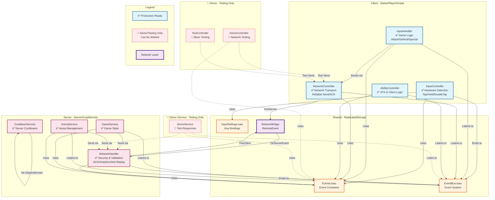

# 🏗️ System Dependencies & Architecture

## 📊 Dependency Graph (Production Grade)



---

## 🔄 Data Flow (Production Path)

### Normal Action Flow

```
┌─────────────────────────────────────────────────────────────┐
│                   PRODUCTION DATA FLOW                       │
└─────────────────────────────────────────────────────────────┘

1. Player Input (Hardware)
   └─> Keyboard "E" pressed
        │
        ▼
2. InputController (Detection Layer)
   ├─> Detect input type: Tap/Hold/DoubleTap
   ├─> Debounce protection (0.1s)
   └─> Emit: EventBus:Emit(INPUT_ACTION, "ATTACK")
        │
        ▼
3. InputHandler (Logic Layer)
   ├─> Listen: EventBus:On(INPUT_ACTION)
   ├─> Route to: HandleAttack()
   ├─> Check cooldown (client-side, visual)
   ├─> Validate state (alive? not in menu?)
   ├─> Queue action
   └─> Send: NetworkController:Send(PLAYER_ATTACK, data)
        │
        ▼
4. NetworkController (Transport Layer)
   ├─> Add to queue
   ├─> Batch process (30 FPS)
   └─> RemoteEvent:FireServer(PLAYER_ATTACK, data)
        │
        ▼ Network
        │
5. NetworkHandler (Security Layer)
   ├─> OnServerEvent receives
   ├─> Check rate limit (10 events/5s per player)
   ├─> Check anti-replay (messageId)
   ├─> Validate payload (sanitize)
   ├─> Check allowlist (PLAYER_ATTACK allowed?)
   └─> Emit: EventBus:Emit(PLAYER_ATTACK, player, data)
        │
        ▼
6. GameService (Business Logic)
   ├─> Listen: EventBus:On(PLAYER_ATTACK)
   ├─> Check cooldown (server-side, CooldownService)
   ├─> Validate game state (in combat? alive?)
   ├─> Process attack (damage calculation)
   ├─> Update game state
   ├─> Set cooldown
   └─> Send response: NetworkHandler:SendToClient(player, ATTACK_RESULT)
        │
        ▼
7. NetworkController (Client receives)
   ├─> OnClientEvent
   ├─> Emit: EventBus:Emit(ATTACK_RESULT, data)
   └─> Update UI (cooldown animation)
```

### Reliable Send Flow (Important Actions)

```
┌─────────────────────────────────────────────────────────────┐
│              RELIABLE SEND WITH ACK & RETRY                  │
└─────────────────────────────────────────────────────────────┘

1. Client: NetworkController:SendReliable(event, data)
   ├─> Generate messageId (GUID)
   ├─> data._msgId = messageId
   ├─> Add to retry queue
   └─> FireServer(event, data)
        │
        ▼
2. Server: NetworkHandler receives
   ├─> Extract messageId
   ├─> Check anti-replay (duplicate messageId?)
   ├─> Store messageId (60s TTL)
   ├─> Process event
   └─> Send ACK: SendToClient(player, "__ACK", {messageId})
        │
        ▼
3. Client: Receives ACK
   ├─> Match messageId
   ├─> Remove from retry queue
   └─> Success ✅
        │
4. If NO ACK received (timeout 5s):
   ├─> Retry #1 (after 2s)
   ├─> Retry #2 (after 2s)
   ├─> Retry #3 (after 2s)
   └─> If still no ACK: Emit NETWORK_SEND_FAILED
```

---

## 🗂️ Module Dependencies Tree

### Client Modules

```
StarterPlayerScripts/
│
├── Init.client.luau
│   ├── Requires: Controllers/*
│   ├── Calls: controller:Init()
│   └── Calls: controller:Start()
│
├── InputController.luau
│   ├── Dependencies:
│   │   ├── ReplicatedStorage.Shared.Events
│   │   ├── ReplicatedStorage.Shared.InputSettings
│   │   └── ReplicatedStorage.SystemsShared.EventBus
│   └── Emits: INPUT_ACTION
│
├── InputHandler.luau
│   ├── Dependencies:
│   │   ├── ReplicatedStorage.Shared.Events
│   │   ├── ReplicatedStorage.SystemsShared.EventBus
│   │   └── script.Parent.NetworkController
│   ├── Listens: INPUT_ACTION
│   └── Calls: NetworkController:Send()
│
├── NetworkController.luau
│   ├── Dependencies:
│   │   ├── ReplicatedStorage.Shared.Events
│   │   ├── ReplicatedStorage.SystemsShared.EventBus
│   │   └── ReplicatedStorage.SystemsShared.Network.NetworkBridge
│   ├── Creates: RemoteEvent connection
│   └── Methods: Send(), SendReliable(), GetStats()
│
├── AbilityController.luau
│   ├── Dependencies:
│   │   ├── ReplicatedStorage.Shared.Events
│   │   └── ReplicatedStorage.SystemsShared.EventBus
│   └── Listens: ABILITY_CAST, ABILITY_EFFECT
│
└── 🧪 Demo Controllers (Development Only)
    ├── DemoController.luau
    │   └── Dependencies: NetworkController, Events
    └── TestController.luau
        └── Dependencies: NetworkController, Events
```

### Server Modules

```
ServerScriptService/
│
├── Init.server.luau
│   ├── Requires: Services/*
│   ├── Calls: service:Init() (dependency setup)
│   └── Calls: service:Start() (runtime)
│
├── NetworkHandler.luau
│   ├── Dependencies:
│   │   ├── ReplicatedStorage.Shared.Events
│   │   ├── ReplicatedStorage.SystemsShared.EventBus
│   │   └── ReplicatedStorage.SystemsShared.Network.NetworkBridge
│   ├── Creates: RemoteEvent server connection
│   ├── Features: Rate limiting, Anti-replay, ACK, Analytics
│   └── Methods: SendToClient(), Broadcast(), SendToClientReliable()
│
├── GameService.luau
│   ├── Dependencies:
│   │   ├── ReplicatedStorage.Shared.Events
│   │   ├── ReplicatedStorage.SystemsShared.EventBus
│   │   ├── script.Parent.NetworkHandler
│   │   └── script.Parent.CooldownService
│   ├── Listens: PLAYER_ATTACK, PLAYER_DEFEND, PLAYER_SPECIAL
│   └── Manages: Game state, rounds, combat
│
├── ArenaService.luau
│   ├── Dependencies:
│   │   ├── ReplicatedStorage.Shared.Events
│   │   ├── ReplicatedStorage.SystemsShared.EventBus
│   │   └── script.Parent.NetworkHandler
│   ├── Listens: GAME_START, GAME_END
│   └── Manages: Arena spawning, cleanup
│
├── CooldownService.luau
│   ├── Dependencies: None (pure logic)
│   ├── Tracks: Per-player cooldowns
│   └── Methods: IsOnCooldown(), SetCooldown(), GetRemaining()
│
└── 🧪 DemoService.luau (Development Only)
    ├── Dependencies:
    │   ├── ReplicatedStorage.Shared.Events
    │   ├── ReplicatedStorage.SystemsShared.EventBus
    │   └── script.Parent.NetworkHandler
    └── Handles: DEMO_PING, DEMO_REQUEST_DATA, etc.
```

### Shared Modules

```
ReplicatedStorage/
│
├── Shared/
│   ├── Events.luau
│   │   └── No dependencies (pure data)
│   │
│   └── InputSettings.luau
│       └── No dependencies (pure config)
│
└── SystemsShared/
    ├── EventBus.luau
    │   └── No dependencies (core system)
    │
    └── Network/
        └── NetworkBridge (RemoteEvent)
            └── Created by NetworkHandler:Init()
```

---

## 🔐 Security Layers

```
┌─────────────────────────────────────────────────────────────┐
│                    SECURITY LAYERS                           │
└─────────────────────────────────────────────────────────────┘

Layer 1: Client Validation (InputHandler)
├── Cooldown check (visual feedback)
├── State check (alive? in menu?)
└── Basic validation

Layer 2: Network Security (NetworkHandler)
├── Rate Limiting
│   ├── Per-player: 10 events / 5 seconds
│   ├── Global: 100 events / second
│   └── Burst: 3 events / 0.5 seconds
├── Event Allowlist
│   └── Only allowed events processed
├── Anti-Replay Protection
│   ├── Message ID tracking
│   └── Duplicate rejection (60s window)
├── Payload Sanitization
│   ├── Type checking
│   ├── Size limits (MAX_STRING_LENGTH, MAX_TABLE_SIZE)
│   └── Circular reference detection
└── Suspicious Activity Tracking
    ├── Strike system (5 strikes = kick)
    └── Pattern detection

Layer 3: Server Validation (GameService)
├── Re-check cooldown (server-authoritative)
├── Validate game state (in combat? round active?)
├── Check resources (mana? stamina?)
├── Validate target (alive? in range?)
└── Verify permissions (can use ability?)

Layer 4: Analytics & Monitoring
├── Event tracking (all events logged)
├── Error tracking (last 100 errors)
├── Health monitoring (EPS, uptime)
└── Suspicious player list
```

---

## 📊 Event Flow Map

### Production Events

```
CLIENT → SERVER:
├── INPUT_ACTION (internal only, via EventBus)
├── PLAYER_ATTACK
├── PLAYER_DEFEND
├── PLAYER_SPECIAL
├── GAME_START_REQUESTED
├── SETTINGS_CHANGED
└── TOGGLE_UI

SERVER → CLIENT:
├── UI_SHOW_NOTIFICATION
├── UI_UPDATE_SCORE
├── UI_UPDATE_HEALTH
├── RESULTS_SHOW_WINNER
├── ATTACK_RESULT
├── ABILITY_EFFECT
└── __ACK (for reliable send)
```

### Demo Events (Development Only)

```
🧪 CLIENT → SERVER:
├── DEMO_PING
├── DEMO_CHAT_MESSAGE
├── DEMO_REQUEST_DATA
├── TEST_CLIENT_BUTTON_CLICK
├── TEST_BUTTON_PRESSED
└── (Legacy: PLAYER_ATTACK/DEFEND/SPECIAL for testing)

🧪 SERVER → CLIENT:
├── DEMO_HELLO_RESPONSE
├── DEMO_BROADCAST_MESSAGE
├── DEMO_SEND_DATA
├── DEMO_ANNOUNCEMENT
└── TEST_SERVER_RESPONSE
```

---

## 🎯 Initialization Order

### Server Initialization

```lua
-- Init.server.luau execution order:

1. Load Services
   ├── NetworkHandler = require(Services.NetworkHandler)
   ├── GameService = require(Services.GameService)
   ├── ArenaService = require(Services.ArenaService)
   └── DemoService = require(...) -- if not IS_PRODUCTION

2. Init Phase (Dependency Setup)
   ├── NetworkHandler:Init()
   │   ├── Create RemoteEvent
   │   ├── Setup allowlists
   │   └── Register validators
   ├── GameService:Init()
   ├── ArenaService:Init()
   └── DemoService:Init() -- if not IS_PRODUCTION

3. Start Phase (Runtime)
   ├── NetworkHandler:Start()
   │   └── Connect OnServerEvent
   ├── GameService:Start()
   │   └── Listen to EventBus
   ├── ArenaService:Start()
   └── DemoService:Start() -- if not IS_PRODUCTION
```

### Client Initialization

```lua
-- Init.client.luau execution order:

1. Load Controllers
   ├── For each ModuleScript in Controllers/
   │   ├── Skip DemoController if IS_PRODUCTION
   │   ├── Skip TestController if IS_PRODUCTION
   │   └── require(moduleScript)

2. Init Phase
   ├── InputController:Init()
   │   └── Bind all actions (ContextActionService)
   ├── InputHandler:Init()
   ├── NetworkController:Init()
   │   └── Connect to RemoteEvent
   └── AbilityController:Init()

3. Start Phase
   ├── InputController:Start()
   │   └── Start combo monitoring
   ├── InputHandler:Start()
   │   ├── Listen to INPUT_ACTION
   │   └── Start action queue processing
   ├── NetworkController:Start()
   │   ├── Listen for ACK
   │   └── Start health monitoring
   └── AbilityController:Start()
```

---

## 🧪 Demo vs Production Comparison

| Aspect | Demo | Production |
|--------|------|------------|
| **Client** | DemoController | InputHandler |
| **Server** | DemoService | GameService |
| **Purpose** | Network testing | Actual gameplay |
| **Events** | DEMO_* | PLAYER_*, GAME_* |
| **Validation** | ❌ Minimal | ✅ Full |
| **Cooldown** | ❌ None | ✅ Server-authoritative |
| **Analytics** | ❌ Basic | ✅ Full tracking |
| **Can Delete** | ✅ Yes (after testing) | ❌ No (core system) |
| **Enabled When** | IS_PRODUCTION = false | IS_PRODUCTION = true |

---

## 📦 Module Export Types

### Client Types

```lua
-- InputController
export type InputController = {
    Init: (self: InputController) -> (),
    Start: (self: InputController) -> (),
    EnableInput: (self: InputController, enabled: boolean) -> (),
    GetInputState: (self: InputController) -> InputState,
}

-- InputHandler
export type InputHandler = {
    Init: (self: InputHandler) -> (),
    Start: (self: InputHandler) -> (),
    HandleAttack: (self: InputHandler) -> (),
    HandleDefend: (self: InputHandler) -> (),
}

-- NetworkController
export type NetworkController = {
    Init: (self: NetworkController) -> (),
    Start: (self: NetworkController) -> (),
    Send: (self: NetworkController, eventName: string, data: any) -> (),
    SendReliable: (self: NetworkController, eventName: string, data: any, maxRetries: number?) -> (),
    GetStats: (self: NetworkController) -> {ping: number, pendingMessages: number},
}
```

### Server Types

```lua
-- NetworkHandler
export type NetworkHandler = {
    Init: (self: NetworkHandler) -> (),
    Start: (self: NetworkHandler) -> (),
    SendToClient: (self: NetworkHandler, player: Player, eventName: string, ...any) -> (),
    Broadcast: (self: NetworkHandler, eventName: string, ...any) -> (),
    SendToClientReliable: (self: NetworkHandler, player: Player, eventName: string, data: any, callback: (() -> ())?) -> (),
    GetAnalytics: (self: NetworkHandler) -> AnalyticsData,
    GetNetworkHealth: (self: NetworkHandler) -> NetworkHealth,
}

-- GameService
export type GameService = {
    Init: (self: GameService) -> (),
    Start: (self: GameService) -> (),
}

-- CooldownService
export type CooldownService = {
    IsOnCooldown: (self: CooldownService, player: Player, action: string) -> boolean,
    SetCooldown: (self: CooldownService, player: Player, action: string) -> (),
    GetRemaining: (self: CooldownService, player: Player, action: string) -> number,
}
```

---

## 🔄 Migration from Demo to Production

### When to Remove Demo

✅ **Remove when:**
- InputHandler fully implemented and tested
- GameService handles all combat actions
- All critical paths tested
- Ready for production deployment

### How to Remove Demo

```lua
-- 1. Set IS_PRODUCTION = true
-- ServerScriptService/Init.server.luau
local IS_PRODUCTION = true

-- StarterPlayerScripts/Init.client.luau
local IS_PRODUCTION = true

-- 2. Demo files auto-skipped, or delete:
-- ❌ DemoController.luau
-- ❌ TestController.luau
-- ❌ DemoService.luau

-- 3. Remove demo events from Events.luau:
-- ❌ DEMO_PING
-- ❌ DEMO_PONG
-- ❌ DEMO_REQUEST_DATA
-- etc.
```

---

## 📝 Summary

**Core Dependencies:**
- ✅ EventBus (no dependencies)
- ✅ Events (no dependencies)
- ✅ InputSettings (no dependencies)

**Client Layer:**
- ✅ InputController → Events, InputSettings, EventBus
- ✅ InputHandler → Events, EventBus, NetworkController
- ✅ NetworkController → Events, EventBus, RemoteEvent

**Server Layer:**
- ✅ NetworkHandler → Events, EventBus, RemoteEvent
- ✅ GameService → Events, EventBus, NetworkHandler, CooldownService
- ✅ ArenaService → Events, EventBus, NetworkHandler
- ✅ CooldownService → (no dependencies)

**Demo Layer (Temporary):**
- 🧪 DemoController → NetworkController, Events
- 🧪 DemoService → Events, EventBus, NetworkHandler

---

**Version:** 2.0 - Production Grade  
**Last Updated:** 2024  
**Features:** ACK, Retry, Analytics, Anti-Replay, Security  
**Author:** OneShortArena Team

---

## 6️⃣ อัปเดต docs/deps.md - เพิ่ม IdempotentGuard

### Utility Modules

```
ServerScriptService/Utils/
│
├── IdempotentGuard.luau
│   ├── Purpose: Prevent double Init/Start
│   ├── Features:
│   │   ✅ Thread-safe state tracking
│   │   ✅ Lifecycle validation
│   │   ✅ Analytics tracking
│   │   └── Global registry
│   └── Usage:
│       local guard = IdempotentGuard.new("MyService")
│       if guard:MarkInitialized() then
│           -- Init logic
│       end
│
└── ExecutionGuard.luau
    ├── Purpose: Advanced execution control
    ├── Features:
    │   ✅ RunOnce - Execute function only once
    │   ✅ In-progress lock - Prevent concurrent execution
    │   ✅ Result reuse - Cache and return results
    │   ✅ Timeout support - Auto-release locks
    │   └── Thread-safe
    └── Usage:
        local guard = ExecutionGuard.new()
        local success, result = guard:RunOnce("loadData", function()
            return loadDataFromAPI()
        end, { timeout = 10, cacheResult = true })
```