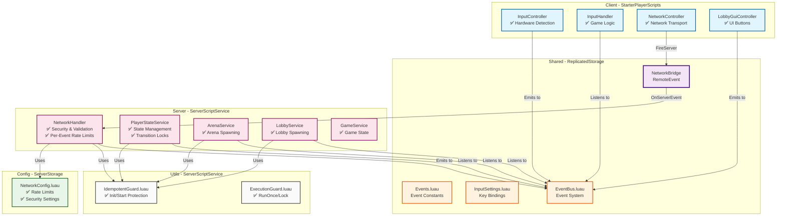

# 🏗️ System Dependencies & Architecture

## 📊 Version Information

| Component | Version | Status |
|-----------|---------|--------|
| **Architecture** | 3.0 | ✅ Production Ready |
| **NetworkConfig** | 1.0 | ✅ Centralized |
| **Security** | P0 Fixed | ✅ Hardened |
| **Last Updated** | 2024 | - |

---

## 📊 Dependency Graph (Production Grade)



---

## 🗂️ Complete File Structure

```
OneShortArena-Roblox/
│
├── 📁 src/
│   │
│   ├── 📁 ReplicatedStorage/
│   │   ├── 📁 Shared/
│   │   │   ├── Events.luau              # Event constants
│   │   │   └── InputSettings.luau       # Key bindings
│   │   │
│   │   ├── 📁 SystemsShared/
│   │   │   ├── EventBus.luau            # Event system
│   │   │   └── 📁 Network/
│   │   │       └── NetworkBridge        # RemoteEvent
│   │   │
│   │   └── 📁 Utils/
│   │       └── IdempotentGuard.luau     # Client-side guard
│   │
│   ├── 📁 ServerStorage/
│   │   └── 📁 Configs/
│   │       └── NetworkConfig.luau       # ✅ NEW: Centralized config
│   │
│   ├── 📁 ServerScriptService/
│   │   ├── Init.server.luau             # Server bootstrap
│   │   │
│   │   ├── 📁 Services/
│   │   │   ├── NetworkHandler.luau      # ✅ P0 Fixed
│   │   │   ├── PlayerStateService.luau  # ✅ P0 Fixed
│   │   │   ├── ArenaService.luau        # ✅ P0 Fixed
│   │   │   ├── LobbyService.luau
│   │   │   ├── GameService.luau
│   │   │   └── TestService.luau
│   │   │
│   │   └── 📁 Utils/
│   │       ├── IdempotentGuard.luau
│   │       └── ExecutionGuard.luau
│   │
│   ├── 📁 StarterPlayer/
│   │   └── 📁 StarterPlayerScripts/
│   │       ├── Init.client.luau         # Client bootstrap
│   │       │
│   │       └── 📁 Controllers/
│   │           ├── InputController.luau
│   │           ├── InputHandler.luau
│   │           ├── NetworkController.luau
│   │           └── LobbyGuiController.luau  # ✅ NEW
│   │
│   └── 📁 StarterGui/
│       └── LobbyGui/                    # UI for Play/Cancel
│           ├── PlayButton
│           └── CancelButton
│
├── 📁 docs/
│   ├── deps.md                          # This file
│   ├── Lobby-to-Arena-Guide.md          # Teleport system
│   ├── Risk-Assessment.md               # Security audit
│   └── NetworkConfig-Guide.md           # ✅ NEW
│
└── 📁 Packages/
    └── Signal.lua                       # Signal library
```

---

## 🔐 Security Architecture

### Multi-Layer Protection

```
┌─────────────────────────────────────────────────────────────┐
│                  SECURITY LAYERS (P0 Fixed)                  │
└─────────────────────────────────────────────────────────────┘

Layer 1: UI (Client-side) - LobbyGuiController
├── Button cooldown (1s)
├── Visual feedback
└── Prevent spam clicks

Layer 2: InputHandler (Client-side)
├── State validation
└── Basic checks

Layer 3: NetworkHandler (Server-side) - ✅ Enhanced
├── Global rate limiting (10 events/5s)
├── Per-event rate limiting (from NetworkConfig)
├── Anti-replay (message ID tracking)
├── Payload validation
│   ├── Size limits
│   ├── String length limits
│   └── Table depth limits
└── Event allowlist

Layer 4: PlayerStateService (Server-side) - ✅ P0 Fixed
├── Transition locks (atomic)
├── Transition cooldowns (2s)
├── State validation
└── pcall protection (always release lock)

Layer 5: ArenaService (Server-side) - ✅ P0 Fixed
├── Teleport cooldowns (5s)
├── Combat check (5s after damage)
├── Character validation
└── Health check
```

---

## 📊 Event Rate Limits (NetworkConfig)

| Category | Events | Rate | Window |
|----------|--------|------|--------|
| **Arena/Lobby** | RequestToArena, RequestToLobby | 1 | 5s |
| **Combat** | Attack, Defend, Special | 5-10 | 5s |
| **Movement** | Move, Jump, Sprint | 15-30 | 5s |
| **UI** | Settings, ToggleUI | 5-10 | 5s |
| **Inventory** | Purchase, Equip | 1-5 | 2-5s |
| **Social** | Chat, Emote | 3-5 | 5s |
| **Testing** | TestPing | 20 | 5s |

---

## 🔄 Initialization Order

### Server

```lua
1. Load NetworkConfig (Configs)
2. NetworkHandler:Init() - Create RemoteEvent, setup limits
3. LobbyService:Init() - Find spawn points
4. ArenaService:Init() - Find arena spawns
5. PlayerStateService:Init() - Register events
6. GameService:Init()
7. TestService:Init()
8. All :Start() methods
```

### Client

```lua
1. Load IdempotentGuard (Utils)
2. InputController:Init() - Bind keys
3. InputHandler:Init()
4. NetworkController:Init() - Connect to RemoteEvent
5. LobbyGuiController:Init() - Find UI buttons
6. All :Start() methods
```

---

## 📚 Related Documentation

- [Lobby-to-Arena-Guide.md](./Lobby-to-Arena-Guide.md) - Teleport system
- [Risk-Assessment.md](./Risk-Assessment.md) - Security audit
- [NetworkConfig-Guide.md](./NetworkConfig-Guide.md) - Rate limits config

---

**Version:** 3.0 - Production Grade  
**Status:** ✅ P0 Fixed, Security Hardened  
**Author:** OneShortArena Team