```mermaid
graph TD
    %% --- Style Definitions ---
    classDef client fill:#e1f5fe,stroke:#01579b,stroke-width:2px;
    classDef server fill:#fce4ec,stroke:#880e4f,stroke-width:2px;
    classDef shared fill:#fff3e0,stroke:#e65100,stroke-width:2px;
    classDef package fill:#e8f5e9,stroke:#1b5e20,stroke-width:2px,stroke-dasharray: 5 5;
    classDef network fill:#f3e5f5,stroke:#4a148c,stroke-width:3px;
    classDef demo fill:#ffebee,stroke:#c62828,stroke-width:2px,stroke-dasharray: 3 3;

    %% --- Client Side (Blue) ---
    subgraph Client [Client Side - StarterPlayerScripts]
        ClientInit[Init.client.luau]:::client
        InputController[InputController ✅]:::client
        InputHandler[InputHandler ✅]:::client
        NetworkController[NetworkController ✅]:::client
        UIController[UIController 🔨]:::client
    end

    %% --- Server Side (Pink) ---
    subgraph Server [Server Side - ServerScriptService]
        ServerInit[Init.server.luau]:::server
        NetworkHandler[NetworkHandler ✅]:::server
        GameService[GameService ✅]:::server
        ArenaService[ArenaService ✅]:::server
        CombatService[CombatService ✅]:::server
        CooldownService[CooldownService ✅]:::server
        ProfileService[ProfileService 🔨]:::server
    end

    %% --- Demo Layer (Red - Temporary) ---
    subgraph Demo [🧪 Demo Layer - ลบได้ในอนาคต]
        DemoController[DemoController 🧪]:::demo
        DemoService[DemoService 🧪]:::demo
    end

    %% --- Shared Systems (Orange) ---
    subgraph Shared [ReplicatedStorage/SystemsShared]
        EventBus:::shared
        Network[Network Folder]:::network
        RemoteEvent[NetworkBridge]:::network
    end

    %% --- Shared Data (Orange) ---
    subgraph SharedData [ReplicatedStorage/Shared]
        Events[Events.luau]:::shared
        InputSettings[InputSettings.luau]:::shared
        Configs[GameConfigs 🔨]:::shared
    end

    %% --- Packages (Green) ---
    subgraph Packages [Wally Packages]
        Signal:::package
        Promise[Promise 🔨]:::package
    end

    %% --- Client Initialization Flow ---
    ClientInit -->|1. Requires| NetworkController
    ClientInit -->|2. Requires| InputController
    ClientInit -->|3. Requires| InputHandler
    ClientInit -.->|4. Requires 🔨| UIController
    ClientInit -.->|Demo Only 🧪| DemoController

    %% --- Server Initialization Flow ---
    ServerInit -->|1. Init & Start| NetworkHandler
    ServerInit -->|2. Init & Start| CooldownService
    ServerInit -->|3. Init & Start| GameService
    ServerInit -->|4. Init & Start| ArenaService
    ServerInit -->|5. Init & Start| CombatService
    ServerInit -.->|Demo Only 🧪| DemoService

    %% --- Production Input Flow ---
    InputController -->|Emit INPUT_ACTION| EventBus
    EventBus -->|Tap/Hold/DoubleTap| InputHandler
    InputHandler -->|Send Actions| NetworkController
    NetworkController -->|FireServer| RemoteEvent

    %% --- Demo Flow (Temporary) ---
    DemoController -.->|Test Events| NetworkController
    DemoService -.->|Test Responses| NetworkHandler

    %% --- Server Flow ---
    RemoteEvent -->|OnServerEvent| NetworkHandler
    NetworkHandler -->|Emit Events| EventBus
    
    EventBus -->|PLAYER_ATTACK| CombatService
    EventBus -->|GAME_START| GameService
    EventBus -->|Arena Events| ArenaService
    
    CombatService -->|Check Cooldown| CooldownService
    CombatService -->|Send Response| NetworkHandler
    
    GameService -->|Broadcast| NetworkHandler
    ArenaService -->|Notify Clients| NetworkHandler

    %% --- Network Communication ---
    NetworkHandler -->|FireClient/FireAllClients| RemoteEvent
    RemoteEvent -->|OnClientEvent| NetworkController
    NetworkController -->|Emit Events| EventBus
    EventBus -->|Update UI| InputHandler

    %% --- Dependencies ---
    InputController -->|Uses| InputSettings
    InputController -->|Uses| Events
    InputHandler -->|Uses| Events
    
    NetworkHandler -->|Uses| Events
    CombatService -->|Uses| Events
    GameService -->|Uses| Events
    
    EventBus -->|Requires| Signal
    ProfileService -.->|Uses 🔨| Promise

    %% --- Legend ---
    subgraph Legend
        L1[✅ Implemented - Production Ready]:::client
        L2[🔨 Planned - Not Yet Implemented]:::shared
        L3[🧪 Demo - For Testing Only]:::demo
    end
```

---

## 🏗️ สถาปัตยกรรมระบบ

### 📊 ภาพรวม Data Flow (Production)

```
┌─────────────────────────────────────────────────────────────┐
│                   PRODUCTION ARCHITECTURE                    │
└─────────────────────────────────────────────────────────────┘

Player Input (Keyboard/Mobile)
         │
         ▼
┌──────────────────────┐
│  InputController     │  ← จับ hardware input (Tap/Hold/DoubleTap)
│  (Client)            │     Timer-based Hold detection
└──────────────────────┘
         │
         │ EventBus:Emit(INPUT_ACTION, "Attack")
         ▼
┌──────────────────────┐
│  InputHandler        │  ← แปลง input → game actions
│  (Client)            │     Cooldown check, State validation
└──────────────────────┘
         │
         │ NetworkController:Send(PLAYER_ATTACK, data)
         ▼
┌──────────────────────┐
│  NetworkController   │  ← Client-Server bridge
│  (Client)            │     Action queue, Batch send
└──────────────────────┘
         │
         │ RemoteEvent:FireServer()
         ▼
┌──────────────────────┐
│  NetworkHandler      │  ← Security layer
│  (Server)            │     Rate limit, Validation, Whitelist
└──────────────────────┘
         │
         │ EventBus:Emit(PLAYER_ATTACK, player, data)
         ▼
┌──────────────────────┐
│  CombatService       │  ← Game logic
│  (Server)            │     Process attack, Calculate damage
└──────────────────────┘
         │
         ├─► CooldownService (Check/Set cooldown)
         ├─► ProfileService (Update stats)
         └─► NetworkHandler (Send response)
```

---

## 📁 โครงสร้างไฟล์ (Production)

### Client (StarterPlayerScripts)

```
StarterPlayerScripts/
├── Init.client.luau                    ← Entry point
└── Controllers/
    ├── InputController.luau            ✅ Hardware input (Tap/Hold/DoubleTap)
    ├── InputHandler.luau               ✅ Game actions (Attack/Defend/Special)
    ├── NetworkController.luau          ✅ Network communication
    ├── UIController.luau               🔨 UI management
    └── DemoController.luau             🧪 Testing only (ลบได้)
```

**หน้าที่:**
- **InputController**: จับ input จาก keyboard/mobile → ส่ง events ผ่าน EventBus
- **InputHandler**: แปลง input events → game actions → ส่งไป Server
- **NetworkController**: จัดการ RemoteEvent, Queue actions
- **UIController**: อัพเดท UI ตาม server responses
- **DemoController**: ทดสอบ network (**ไม่ใช้ใน Production**)

---

### Server (ServerScriptService)

```
ServerScriptService/
├── Init.server.luau                    ← Entry point
└── Services/
    ├── NetworkHandler.luau             ✅ Network security & validation
    ├── CooldownService.luau            ✅ Server-side cooldown tracking
    ├── GameService.luau                ✅ Game state (rounds, lobby)
    ├── ArenaService.luau               ✅ Arena setup & cleanup
    ├── CombatService.luau              ✅ Combat logic & damage
    ├── ProfileService.luau             🔨 Player data persistence
    └── DemoService.luau                🧪 Testing only (ลบได้)
```

**หน้าที่:**
- **NetworkHandler**: รับ/ส่ง network events, Security validation
- **CooldownService**: จัดการ cooldown server-authoritative
- **GameService**: Game lifecycle (start, end, rounds)
- **ArenaService**: Map management, spawn points
- **CombatService**: Damage calculation, combat validation
- **ProfileService**: Save/load player data
- **DemoService**: ทดสอบ network responses (**ไม่ใช้ใน Production**)

---

### Shared (ReplicatedStorage)

```
ReplicatedStorage/
├── SystemsShared/
│   ├── EventBus.luau                   ✅ Event system (Signal-based)
│   └── Network/
│       └── NetworkBridge               ✅ RemoteEvent (auto-created)
│
└── Shared/
    ├── Events.luau                     ✅ Event name constants
    ├── InputSettings.luau              ✅ Key bindings config
    └── GameConfigs.luau                🔨 Game configurations
```

---

## 🎯 ระบบหลัก (Production)

### 1. Input System

**Components:**
```
InputController → InputHandler → NetworkController → Server
```

**InputController** (`InputController.luau`)
- รับ input จาก ContextActionService
- ตรวจจับ: Tap, Hold (Timer-based), DoubleTap, Release, Combo
- ส่ง events ผ่าน EventBus (ไม่ส่งไปยัง Server โดยตรง)

**InputHandler** (`InputHandler.luau`)
- รับ INPUT_ACTION events จาก InputController
- แปลงเป็น game-specific actions (Attack, Defend, Special)
- ตรวจสอบ cooldown ฝั่ง client (visual feedback)
- Queue actions แล้วส่งเป็น batch ไปยัง Server

**ไม่มี DemoController** ใน Production!

---

### 2. Network System

**Components:**
```
Client: NetworkController ↔ RemoteEvent ↔ Server: NetworkHandler
```

**NetworkController** (`NetworkController.luau`)
- จัดการ RemoteEvent ฝั่ง Client
- Queue actions และ batch send (ลด network traffic)
- รับ responses จาก Server

**NetworkHandler** (`NetworkHandler.luau`)
- Security layer: Rate limit, Validation, Whitelist
- ส่ง events ไปยัง Services ผ่าน EventBus
- ส่ง responses กลับไปยัง Clients

**ไม่มี DemoService** ใน Production!

---

### 3. Combat System

**Components:**
```
CombatService + CooldownService + ProfileService
```

**CombatService** (`CombatService.luau`)
- รับ PLAYER_ATTACK, PLAYER_DEFEND, PLAYER_SPECIAL events
- Validate: Cooldown, HP, Resources, Target
- Calculate: Damage, Knockback, Effects
- Update: ProfileService (stats)
- Respond: NetworkHandler (results)

**CooldownService** (`CooldownService.luau`)
- Server-authoritative cooldown tracking
- Per-player cooldown state
- Configurable cooldown durations
- Client notification

---

## 🧪 Demo Layer (ชั่วคราว - ลบได้)

### DemoController.luau
```lua
-- 🧪 DEMO ONLY - For testing network communication
-- ลบไฟล์นี้ได้เมื่อ InputHandler พร้อมใช้งาน

-- Purpose:
-- - ทดสอบ Ping/Pong
-- - ทดสอบ Data requests
-- - ทดสอบ Broadcast
```

### DemoService.luau
```lua
-- 🧪 DEMO ONLY - For testing server responses
-- ลบไฟล์นี้ได้เมื่อ CombatService พร้อมใช้งาน

-- Purpose:
-- - ทดสอบ DEMO_PING
-- - ทดสอบ DEMO_REQUEST_DATA
-- - ทดสอบ DEMO_BROADCAST_MESSAGE
```

**สิ่งที่ Demo ไม่ทำ:**
- ❌ ไม่ใช้ใน Production
- ❌ ไม่เข้า gameplay loop จริง
- ❌ ไม่มี business logic สำคัญ

**เมื่อไหร่ควรลบ Demo:**
- ✅ เมื่อ InputHandler ทำงานครบ
- ✅ เมื่อ CombatService ทำงานครบ
- ✅ เมื่อ Testing ผ่านแล้ว

---

## 📊 Comparison: Demo vs Production

| Feature | Demo | Production |
|---------|------|------------|
| **Purpose** | Testing network | Actual gameplay |
| **Client** | DemoController | InputHandler |
| **Server** | DemoService | CombatService |
| **Events** | DEMO_PING, DEMO_REQUEST_DATA | PLAYER_ATTACK, PLAYER_DEFEND |
| **Validation** | ❌ Basic | ✅ Full server-side |
| **Cooldown** | ❌ None | ✅ CooldownService |
| **Data Persistence** | ❌ None | ✅ ProfileService |
| **Can Delete?** | ✅ Yes | ❌ No - Core system |

---

## ✅ Implemented Components (Production Ready)

### Client Side
- [x] **InputController** - Hardware input detection
- [x] **InputHandler** - Game action handler
- [x] **NetworkController** - Network communication
- [ ] **UIController** - UI management (TODO)

### Server Side
- [x] **NetworkHandler** - Security & validation
- [x] **CooldownService** - Cooldown tracking
- [x] **GameService** - Game state
- [x] **ArenaService** - Arena management
- [x] **CombatService** - Combat logic
- [ ] **ProfileService** - Data persistence (TODO)

### Shared
- [x] **EventBus** - Event system
- [x] **Events** - Event constants
- [x] **InputSettings** - Input config
- [x] **Network/NetworkBridge** - RemoteEvent

---

## 🎯 Migration Path (ลบ Demo ในอนาคต)

### Phase 1: ปัจจุบัน
```
Production ✅ + Demo 🧪 (ทำงานควบคู่)
```

### Phase 2: เมื่อ Production พร้อม
```
ลบไฟล์:
- DemoController.luau
- DemoService.luau

ลบ Events:
- DEMO_PING
- DEMO_PONG
- DEMO_REQUEST_DATA
- etc.

ลบจาก Init:
- Init.client.luau (remove DemoController)
- Init.server.luau (remove DemoService)
```

### Phase 3: Production Only
```
Production ✅ เท่านั้น
```

---

## 📝 สรุป

**Production Architecture:**
```
Input → InputController → InputHandler → Network → CombatService
```

**Demo Layer (ชั่วคราว):**
```
DemoController → Network → DemoService
(ใช้เพื่อทดสอบเท่านั้น - ลบได้)
```

**Key Points:**
- ✅ **InputController** = Hardware input (Tap/Hold/DoubleTap)
- ✅ **InputHandler** = Game actions (Attack/Defend)
- ✅ **CombatService** = Combat logic (Damage/Validation)
- 🧪 **Demo*** = Testing only (ลบได้ในอนาคต)

---

*Architecture v2.0*
*Separated Demo from Production ✅*