```mermaid
graph TD
    %% --- Style Definitions ---
    classDef client fill:#e1f5fe,stroke:#01579b,stroke-width:2px;
    classDef server fill:#fce4ec,stroke:#880e4f,stroke-width:2px;
    classDef shared fill:#fff3e0,stroke:#e65100,stroke-width:2px;
    classDef package fill:#e8f5e9,stroke:#1b5e20,stroke-width:2px,stroke-dasharray: 5 5;
    classDef network fill:#f3e5f5,stroke:#4a148c,stroke-width:3px;

    %% --- Client Side (Blue) ---
    subgraph Client [Client Side - StarterPlayerScripts]
        ClientInit[Init.client.luau]:::client
        NetworkController:::client
        UIController[UIController*]:::client
        InputController[InputController*]:::client
    end

    %% --- Server Side (Pink) ---
    subgraph Server [Server Side - ServerScriptService]
        ServerInit[Init.server.luau]:::server
        NetworkHandler:::server
        GameService:::server
        ArenaService:::server
        CombatService:::server
        ProfileService[ProfileService*]:::server
    end

    %% --- Shared Systems (Orange) ---
    subgraph Shared [ReplicatedStorage/SystemsShared]
        EventBus:::shared
        Network[Network Folder]:::network
        RemoteEvent[NetworkBridge]:::network
    end

    %% --- Shared Data (Orange) ---
    subgraph SharedData [ReplicatedStorage/Shared]
        Events[Events.luau]:::shared
        Configs[GameConfigs*]:::shared
    end

    %% --- Packages (Green) ---
    subgraph Packages [Wally Packages]
        Signal:::package
        Promise[Promise*]:::package
    end

    %% --- Client Initialization Flow ---
    ClientInit -->|1. Requires| NetworkController
    ClientInit -.->|2. Requires*| UIController
    ClientInit -.->|3. Requires*| InputController

    %% --- Server Initialization Flow ---
    ServerInit -->|1. Init & Start| NetworkHandler
    ServerInit -->|2. Init & Start| GameService
    ServerInit -->|3. Init & Start| ArenaService
    ServerInit -->|4. Init & Start| CombatService

    %% --- Client Controllers Dependencies ---
    NetworkController -->|Requires| EventBus
    NetworkController -->|Requires| Events
    NetworkController -->|WaitForChild| RemoteEvent
    UIController -.->|Uses| EventBus
    InputController -.->|Emits via| NetworkController

    %% --- Server Services Dependencies ---
    NetworkHandler -->|Creates| Network
    NetworkHandler -->|Creates| RemoteEvent
    NetworkHandler -->|Requires| EventBus
    NetworkHandler -->|Requires| Events
    
    GameService -->|Requires| EventBus
    GameService -->|Requires| Events
    GameService -->|Requires| NetworkHandler
    
    ArenaService -->|Requires| EventBus
    ArenaService -->|Requires| Events
    ArenaService -->|Requires| NetworkHandler
    
    CombatService -->|Requires| EventBus
    CombatService -->|Requires| Events
    CombatService -->|Requires| NetworkHandler
    CombatService -.->|Uses*| ProfileService

    %% --- Network Communication ---
    NetworkController -->|FireServer| RemoteEvent
    RemoteEvent -->|OnServerEvent| NetworkHandler
    NetworkHandler -->|FireClient/FireAllClients| RemoteEvent
    RemoteEvent -->|OnClientEvent| NetworkController

    %% --- EventBus Communication ---
    NetworkController -->|Emit Events| EventBus
    NetworkHandler -->|Emit Events| EventBus
    GameService -->|Listen & Emit| EventBus
    ArenaService -->|Listen & Emit| EventBus
    CombatService -->|Listen & Emit| EventBus

    %% --- System Dependencies ---
    EventBus -->|Requires| Signal
    ProfileService -.->|Uses*| Promise

    %% --- Legend ---
    subgraph Legend
        L1[Solid Line = Implemented]:::shared
        L2[Dashed Line = Planned/TODO]:::shared
        L3[* = Not Yet Created]:::shared
    end

    %% --- Notes ---
    Note1[Note: NetworkHandler creates Network folder and RemoteEvent on server startup]:::network
    Note2[Note: All Services follow Init/Start pattern]:::server
    Note3[Note: Client waits for Network structure before initializing]:::client
```

## Current Architecture Summary

### ✅ **Implemented Components**

**Server Services:**
- `Init.server.luau` - Server entry point
- `NetworkHandler.luau` - Server-side network handler with security
- `GameService.luau` - Game state management
- `ArenaService.luau` - Arena/round management
- `CombatService.luau` - Combat validation

**Client Controllers:**
- `Init.client.luau` - Client entry point
- `NetworkController.luau` - Client-side network controller

**Shared Systems:**
- `EventBus.luau` - Event system using Signal
- `Events.luau` - Event name constants
- `Network/NetworkBridge` - RemoteEvent (created at runtime)

**Packages:**
- `Signal` - Event handling library

### 🔨 **Planned/TODO Components** (marked with *)

**Server:**
- `ProfileService.luau` - Player data persistence

**Client:**
- `UIController.luau` - UI management
- `InputController.luau` - Player input handling

**Shared:**
- `GameConfigs` - Configuration data

**Packages:**
- `Promise` - Async operations library

### 📋 **Initialization Flow**

**Server:**
1. NetworkHandler creates Network folder & RemoteEvent
2. All services Init() - setup phase
3. All services Start() - connect EventBus listeners

**Client:**
1. Waits for Network/NetworkBridge RemoteEvent
2. NetworkController connects to EventBus
3. Other controllers initialize (when implemented)

### 🔒 **Security Layer**

- NetworkHandler validates all client→server events
- Rate limiting per player
- Payload validation (depth, size, type checking)
- Event sequence validation
- Whitelist-based event filtering